Kaumadi Wijesooriya<sup>1</sup>, Sameer A Jadaan<sup>2</sup>, Tanuveer Kaur<sup>1</sup>, Kaushalya L Perera<sup>1</sup>, Mark Ziemann<sup>1</sup>*

**Affiliations**

1. Deakin University, Geelong, Australia, School of Life and Environmental Sciences.

2. College of Health and Medical Technology, Middle Technical University, Baghdad, Iraq.

(*) Corresponding author: m.ziemann@deakin.edu.au

## Abstract

Gene set enrichment tests (a.k.a. functional enrichment analysis) are among the most frequently used methods in computational biology. 
Despite this popularity, there are concerns that these methods are being applied incorrectly and the results of some peer-reviewed publications are unreliable.
These problems include the use of inappropriate background gene lists, lack of false discovery rate correction and lack of methodological detail.
To ascertain the frequency of these errors in the literature, we performed a screen of 186 open access research articles describing functional enrichment results.
We find that 95% of analyses using over-representation tests did not implement an appropriate background gene list or did not describe this in the methods.
Failure to perform p-value correction for multiple tests was identified in 43% of analyses.
Many studies lacked detail in the methods section about the tools and gene sets used.
Using seven independent RNA-seq datasets, we show misuse of enrichment tools changes results substantially.
In conclusion, only 15% of functional enrichment studies examined here avoided major flaws, which highlights the poor state of functional enrichment rigour and reporting in the contemporary literature.
This highlights the urgent need for stronger standards for enrichment analysis

## Author summary

Functional enrichment analysis is a commonly used technique to identify trends in large scale biological datasets.
In biomedicine, functional enrichment analysis of gene expression data is frequently applied to identify disease and drug mechanisms.
While enrichment tests were once primarily conducted using complicated scripting languages, web based tools are becoming more widely used.
Users can paste a list of genes into a web-page and receive enrichment results in a matter of seconds.
Despite the popularity of these tools, there are concerns that statistical problems and incomplete reporting could be undermining research quality.
In this article, we conducted a systematic examination of published enrichment analyses and assessed whether (i) any statistical flaws were present and (ii) sufficient methodological detail is provided such that the study could be replicated.
We found that lack of methodological detail and errors in statistical analysis were common, which undermines the reliability and reproducibility of these research articles.
A set of best practices is urgently needed to raise the quality of published work.

## Introduction

Since the turn of the millennium, high throughput “omics” techniques like microarrays and high throughput sequencing have brought with them a deluge of data.
These experiments involve the measurement of thousands of genes simultaneously, and can identify hundreds or even thousands of significant associations with developmental stages or diseases.
Interpreting such data is extraordinarily challenging, as the sheer number of associations can be difficult to investigate in a gene-by-gene manner.
Instead, many tools have been developed in an effort to summarise gene profiles into simplified functional categories.
These functional categories typically represent signaling or biochemical pathways, curated from information present in the literature, hence the name functional enrichment.

Widely used functional enrichment tools can be classified into two main categories; (i) over-representation analysis (ORA) and (ii) functional class scoring (FCS), and the most common application is in differential gene expression analysis.
In ORA, differentially expressed genes (DEGs) meeting a significance and/or fold change threshold are queried against curated pathways (gene sets).
A statistical test is performed to ascertain whether the number of DEGs belonging to a particular gene set is higher than that expected by random chance, as determined by comparison to a background gene list.
These ORA tools can be stand-alone software packages or web services, and they use one or more statistical tests (eg: Fisher’s exact test, hypergeometric test) [1,2].

In the case of ORA for differential expression (eg: RNA-seq), a whole genome background is inappropriate because in any tissue, most genes are not expressed and therefore have no chance of being classified as DEGs.
A good rule of thumb is to use a background gene list consisting of genes detected in the assay at a level where they have a chance of being classified as DEG [3,4].
Using the whole genome background gene list may be suitable for cases where all genes have the capacity of being detected, for example in studies of genetic variation (eg [5]).

FCS tools involve giving each detected gene a differential expression score and then evaluating whether the scores are more positive or negative than expected by chance for each gene set.
The popular Gene Set Enrichment Analysis (GSEA) tool uses permutation approaches to establish whether a gene set is significantly associated with higher or lower scores, either by permuting sample labels or by permuting genes in the differential expression profile [6].

From a user’s perspective, ORA is easier to conduct because it is as simple as pasting a list of gene names into a text box on a website.
FCS tools are more difficult to use, but are reported to have superior sensitivity in detecting subtle associations [7-9].

Although these are powerful tools to summarise complex genomics data, there are concerns that they are not being correctly used.
Tipney and Hunter [3] warn that inappropriate background set selection heavily influences enrichment results.
Timmons et al [10] highlight two cases where an inappropriate background list led to invalid enrichment results in published articles.

While the nominal p-value from the gene set test is appropriate when a single set is examined, functional enrichment analysis typically involves hundreds to thousands of parallel tests, one for each gene set in the library (eg MSigDB v7.4 library contains 32,284 sets [11]).
False discovery rate (FDR) correction of enrichment p-values is therefore required to limit the number of false positives when performing so many concurrent tests [4,12]. 

Lack of methodological detail can severely weaken reproducibility.
In 2001, minimum information about a microarray experiment (MIAME) guidelines were established, resulting in higher reporting standards in publications describing microarray data [13].
Reporting standards for computational biology have been proposed [14,15], but are not widely adopted.
At a minimum, functional enrichment analysis reports should describe the methods used in such detail that the analysis could be replicated.

The main purpose of this work is to survey the frequency of methodological and reporting flaws in the literature, in particular; (i) inappropriate background gene set, (ii) lack of p-value adjustment for multiple comparisons and (iii) lack of essential methodological details.
Secondly, we examine several RNA-seq datasets to evaluate the effect of such issues on the functional enrichment results obtained.

## Results

### A screen of functional enrichment analyses in open access journals

A search of PubMed Central showed 2,941 articles published in 2019 with the keywords “enrichment analysis”, “pathway analysis” or “ontology analysis”.
From these, we initially selected 200 articles for detailed methodological analysis.
We excluded 14 articles from the screen because they did not present any enrichment analysis.
Those excluded articles included articles describing novel enrichment analysis techniques or tools, review articles or conference abstracts.
As some articles included more than one enrichment analysis, the dataset included 235 analyses from 186 articles; this data is available in S1 Table.
A flow diagram of the survey is provided in Fig. 1.

```{r,diagram1,echo=FALSE,fig.width=8,fig.height=4}

library(tidyverse)
library(DiagrammeR)
library(DiagrammeRsvg)
library(rsvg)
suppressWarnings(dir.create("images"))
grViz("digraph flowchart {
      # node definitions with substituted label text
      node [fontname = Helvetica, shape = rectangle]        
      tab1 [label = '@@1']
      tab2 [label = '@@2']
      tab3 [label = '@@3']
      tab4 [label = '@@4']
      tab5 [label = '@@5']
      tab6 [label = '@@6']
      tab7 [label = '@@7']
      tab8 [label = '@@8']
      tab9 [label = '@@9']
      tab10 [label = '@@10']
      tab11 [label = '@@11']
      tab12 [label = '@@12']
      tab13 [label = '@@13']
      
      # edge definitions with the node IDs
      tab1 -> tab2  -> tab4 -> tab5 -> tab6 -> tab7;
      tab2 -> tab3 ;
      tab1 -> tab9 -> tab10;
      tab5 -> tab13   ;
      tab9 -> tab11 -> tab12 -> tab13 -> tab8 ; 
      }
      [1]: 'PMC keyword search (2019): 2941 results'
      [2]: '200 PMC articles selected'
      [3]: '14 articles excluded'
      [4]: '235 analyses screened and cross-checked'
      [5]: 'data entry to spreadsheet'
      [6]: 'data analysis in R'
      [7]: 'summary charts'
      [8]: 'integration with journal and article metrics'
      [9]: 'additional 1300 PMC articles selected'
      [10]: '118 articles excluded'
      [11]: '1395 analyses screened'
      [12]: 'data entry to spreadsheet'
      [13]: 'data analysis in R'
",
width = 700)

tmp <- grViz("digraph flowchart {
      # node definitions with substituted label text
      node [fontname = Helvetica, shape = rectangle]        
      tab1 [label = '@@1']
      tab2 [label = '@@2']
      tab3 [label = '@@3']
      tab4 [label = '@@4']
      tab5 [label = '@@5']
      tab6 [label = '@@6']
      tab7 [label = '@@7']
      tab8 [label = '@@8']
      tab9 [label = '@@9']
      tab10 [label = '@@10']
      tab11 [label = '@@11']
      tab12 [label = '@@12']
      tab13 [label = '@@13']
      
      # edge definitions with the node IDs
      tab1 -> tab2  -> tab4 -> tab5 -> tab6 -> tab7;
      tab2 -> tab3 ;
      tab1 -> tab9 -> tab10;
      tab5 -> tab13   ;
      tab9 -> tab11 -> tab12 -> tab13 -> tab8 ; 
      }
      [1]: 'PMC keyword search (2019): 2941 results'
      [2]: '200 PMC articles selected'
      [3]: '14 articles excluded'
      [4]: '235 analyses screened and cross-checked'
      [5]: 'data entry to spreadsheet'
      [6]: 'data analysis in R'
      [7]: 'summary charts'
      [8]: 'integration with journal and article metrics'
      [9]: 'additional 1300 PMC articles selected'
      [10]: '118 articles excluded'
      [11]: '1395 analyses screened'
      [12]: 'data entry to spreadsheet'
      [13]: 'data analysis in R'
") 

tmp2 <- capture.output(rsvg_pdf(charToRaw(export_svg(tmp)),'images/flowchart.pdf'))

```
*Fig 1. A summary of the survey of functional enrichment analyses.
The survey consists of two parts, with 200 and 1300 PMC articles considered respectively.*

There were articles from 96 journals in the sample, with PLoS One, Scientific Reports, and PeerJ being the biggest contributors (S1 Fig).
There were 18 different omics types, with gene expression array and RNA-seq being the most popular (S1 Fig).
There were 31 different species under study, but Homo sapiens was the most common with 157 analyses (S1 Fig).


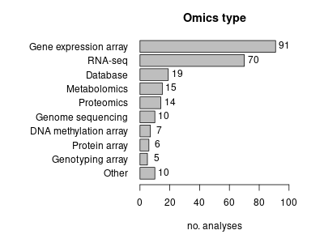

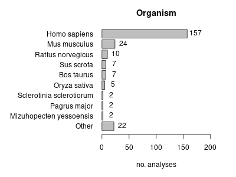

We recorded the use of 26 different gene set libraries, with GO and KEGG being the most frequently used (Fig 2A).
There were 14 analyses where the gene set libraries used were not defined in the article.
Only 18 analyses reported the version of the gene set library used (Fig 2B).
There were 12 different statistical tests used, and the most common reported tests were Fisher’s exact, GSEA and hypergeometric tests; but the statistical test used was not reported for the majority of analyses (Fig 2C).
Fourteen analyses did not conduct any statistical test, as they only showed the number of genes belonging to different sets.
Out of the 225 analyses that performed a statistical test, only 119 (53%) described correcting p-values for multiple testing (Fig 2D).

There were 50 different tools used to perform enrichment analysis, with DAVID and GSEA being the most common; while 15 analyses (6.4%) did not state what tool was used (Fig 2E).
The version of the software used was provided in only 68 of 235 analyses (29%) (Fig 2F).

For analyses using ORA methods, we examined what background gene set was used (Fig 2G).
This revealed that in most cases, the background list was not defined, or it was clear from the article methods section that no specific background list was used.
In a few cases, a background list was mentioned but was inappropriate, for example using a whole genome background for an assay like RNA-seq.
In only 8/197 of cases (4.1%), the appropriate background list was described in the article.

Of the 47 analyses which used a scripted computer language, only 3 provided links to the code used for enrichment analysis (6.4%) (Fig 2H).
For 93 of 235 analyses (40%), the corresponding gene lists/profiles were provided either in the supplement or in the article itself (Fig 2I).

Next, we quantified the frequency of methodological issues and reporting that would undermine the conclusions (Fig 2J).
Lack of appropriate background was the most common issue (179 cases), followed by FDR (94 cases), then lack of data shown (13), inference without test (11 cases), and misinterpreted FDR values (2 cases).
Only 35 analyses (15%) did not exhibit any of these major methodological issues.

During this survey, we noticed some studies grouped up- and down-regulated gene lists together prior to ORA, a practice we were not expecting.
To assess this in a systematic way we assessed differential gene expression studies to determine how common it was to combine up- and down-regulated gene lists prior to ORA (Fig 2K).
From 109 analyses, just 28 studies performed separate analysis of up- and down-regulated gene sets.

We also looked at studies performing GSEA, and whether three important analytical choices were described in the methods.
These are (i) the gene weighting parameter, (ii) test type, ie: permuting sample labels or genes, and (iii) method used for ranking genes.
These parameters were not stated in more than half of the analyses (Fig 2L).

Taken together, these data suggest methodological and reporting deficiencies are widespread in published functional enrichment analyses.

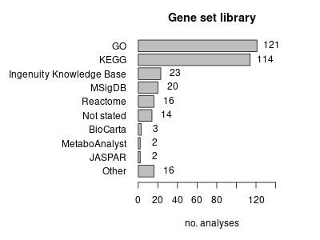

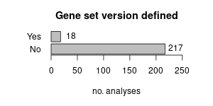

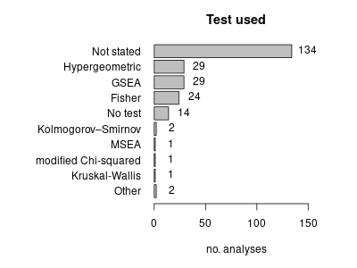

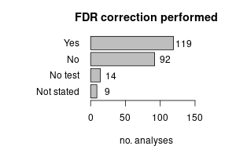

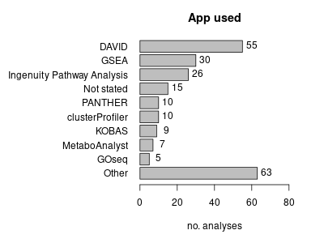


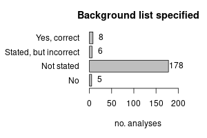

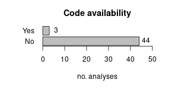

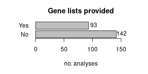

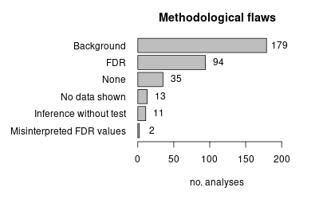

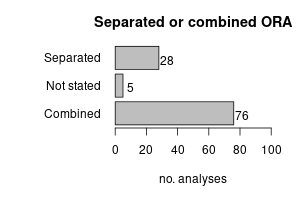

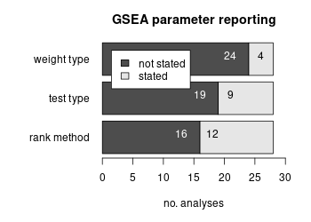

### Analysis scores

To make an accurate assessment of association between analysis quality and bibliometrics, we required a larger sample of articles.
We therefore analysed a further 1,300 articles, bringing the total number of analyses described up to 1630; this dataset is available in S2 Table.

We then scored each analysis based on the presence or absence of methodological issues and included details.
The median score was -4, with a mean of -3.5 and standard deviation of 1.4 (Fig 3A).
Next, we assessed whether these analysis scores are associated with Scimago Journal Rank (SJR), a journal-level citation metric (Fig 3B).
There was no statistically significant association of analysis score and SJR (Pearson r=0.03, p=0.23).

Next, we wanted to know which journals had the highest and lowest scores.
Only journals with five or more analyses were included.
The best scoring journals were Transl Psychiatry, Metabolites and J Exp Clin Cancer Res (Fig 3C), while the poorest were RNA Biol, Mol Med Rep, Cancer Med and World J Gastroenterol (Fig 3D), although we note that there was a wide variation between articles of the same journal.

Then we assessed for an association between mean analysis score and the SJR, for journals with 5 or more analyses (Fig 3E).
Again, there was no association between analysis score and SJR (Pearson r=-0.008, p=0.95).
Next, we assessed whether there was any association between analysis scores and the number of citations received by the articles.
After log transforming the citation data, there was no association between citations and analysis scores (Pearson r=0.02, p=0.39) (Fig 3F).
Taken together, these findings suggest that these methodological issues are not limited to lower ranking or poorly cited articles.


### An example of functional enrichment analysis misuse

To demonstrate whether functional enrichment analysis misuse affects results and downstream interpretation, we used an example RNA-seq dataset examining the effect of high glucose exposure on hepatocytes (SRA accession SRP128998).
Out of 39,297 genes in the annotation set, 15,635 were above the detection threshold (≥10 reads per sample on average).
Statistical analysis revealed 3,472 differentially expressed genes with 1,560 up-regulated and 1,912 down-regulated (FDR<0.05) due to high glucose exposure.

FCS revealed 95 up and 316 down regulated Reactome gene sets (FDR<0.05).
ORA with a background gene list consisting of detected genes revealed 55 upregulated and 238 downregulated gene sets (FDR<0.05).
The overlap between results derived by FCS and ORA methods are shown in Fig 4A, and is reflected by a Jaccard statistic of 0.66, indicating moderate concordance between these methods.

We then performed ORA using a background list consisting of all genes in the annotation set, not just those detected by the assay (indicated as ORA*), which resulted in 147 up and 530 down regulated gene sets (FDR<0.05).
The overlap of ORA with ORA* was relatively small, with a Jaccard statistic of 0.41 (Fig 4B).
Interestingly, 26 gene sets were simultaneously up and downregulated with this approach.

Then we performed ORA analysis after combining up and downregulated genes as sometimes observed in the literature (indicated as ORA comb) with the standard background and again the whole annotation set background (indicated as ORA* comb).
ORA comb revealed only 22 differentially regulated gene sets with a Jaccard similarity to ORA of only 0.04 (Fig 4C).
ORA* comb yielded 64 differentially regulated gene sets with a Jaccard similarity to ORA of only 0.08.
Jaccard values from the above comparisons are summarised in Fig 4D. 

This analysis was conducted with an additional six independent RNA-seq experiments for confirmation (Fig 4E).
The Jaccard values obtained confirm a consistently high degree of similarity between FCS and ORA (mean Jaccard = 0.59).
ORA with a whole genome background consistently gave mean Jaccard values <0.45 as compared to ORA with the recommended background.

These findings suggest that when used properly, FCS and ORA yield similar results, but when used improperly, ORA results can be severely distorted, with less than 50% of the results being the same. 


## Discussion

There have been several articles benchmarking the performance of functional enrichment tools, but there has been relatively little written on how enrichment tools are used (or misused).
A recent study looked at the popularity of frequently used tools and benchmarked their performance [9], but this assumes that the tools were properly used, and methods sufficiently reported.
In this sample of open-access research articles, there appears to be a bias toward tools that are easy to use.
ORA tools that only require pasting lists of gene identifiers into a webpage (ie: DAVID, KOBAS and PANTHER) are collectively more popular than other solutions like GSEA (a stand-alone graphical user interface software for FCS) or any command line tool.
This is despite ORA tools being reported to lack sensitivity when compared to FCS according to previous benchmarking studies [7-9].

Failing to properly describe the background gene list was the most common methodological issue (Fig 2J).
In the seven RNA-seq examples examined here, using the inappropriate whole genome background gave results that were on average only 32% similar to results obtained using the correct background (Fig 4E).
The proportion of ORA studies that combined up- and down-regulated gene lists prior to analysis was high, at 70% (Fig 2K).
As exemplified in Fig 4C, combining up- and down-regulated genes can severely reduce the number of significant gene sets (from 293 gene sets to just 22 in this example).
This is consistent with a previous report indicating that combining up- and down-regulated gene lists is considered poor practice because it reduces sensitivity [16]. 

Although analyses involving GSEA scored better overall, they were not free of issues.
For example, GSEA has different options that impact the results including the ranking metric, gene weighting method and the permutation type (on samples or genes), which were not regularly reported in articles (Fig 2L), limiting reproducibility.

We scored a total of 1630 analyses, revealing only a small fraction of articles obtained a satisfactory score of zero or higher.
The analysis scores we generated did not correlate with journal or article metrics.
This suggests that methodological and reporting problems are not limited to lower ranked journals, but are a more general problem.

There are some limitations of this study that need to be recognised.
Many open access articles examined here are from lower-ranked journals that might not be representative of articles in paywalled journals.
The articles included in this study contained keywords related to functional enrichment in the abstract, and it is plausible that articles in higher ranked journals contain such details in the abstract at lower rates.

Further, it is difficult to ascertain whether these methodological issues invalidate the conclusions of these studies.
We are currently working on a systematic large scale replication study to determine the reliability of these studies with corrected methods.

Nevertheless, these results are a wake-up call for reproducibility and highlight the urgent need for minimum standards for functional enrichment analysis.

## Methods

### Survey of enrichment analysis 

We collated 2,941 articles in PubMed Central published in 2019 that have keywords “enrichment analysis”, “pathway analysis” or “ontology analysis”.
We initially sampled 200 of these articles and collected the following information from the article, searching the methods sections and other parts of the article including the supplement.

* Journal name

* Type of omics data

* Gene set library used, and whether a version was reported

* Statistical test used

* Whether p-values were corrected for multiple comparisons

* Software package used, and whether a version was reported

* Whether an appropriate background gene set was used

* Code availability

* Whether gene profile was provided in the supplement

* Whether the analysis had any major flaws that might invalidate the results. This includes:
(i) background gene set not stated or inappropriate background set used,
(ii) lack of FDR correction,
(iii) no enrichment data shown,
(iv) inference without performing any statistical test, and
(v) misinterpreting p-values by stating results were significant when FDR values indicate they weren’t.

We excluded articles describing novel enrichment analysis techniques/tools, review articles and conference abstracts.
Some articles presented the results of >1 enrichment analysis, so additional rows were added to the table to accommodate them.
These data were entered into a Google Spreadsheet by a team of five researchers.
These articles were cross checked by another team member and any discrepancies were resolved.

For analyses using GSEA, we scanned the articles to identify whether key methodological steps were described, including (i) the gene weighting parameter, (ii) test type, ie: permuting sample labels or genes, and (iii) method used for ranking genes.
For ORA of differential gene expression analyses, we inspected the articles to see evidence that researchers were conducting enrichment of up and down regulated genes separately or combined.
Cleaned data were then loaded into R for downstream analysis.

For assessment of enrichment analysis quality with journal metrics and citations, we required a larger sample, so we selected a further 1300 articles from PMC for analysis.
Results from this sample were not double-checked and so may contain a small number of inaccuracies.
We rated each analysis with a simple approach that deducted points for missing methodological details and awarding points for including extra information (Table 1).

*Table 1. Scoring schema.*

| 1 point deducted | 1 point awarded |
| --- | --- |
| Gene set library origin not stated | Code made available |
| Gene set library version not stated | Gene profile data provided |
| Statistical test not stated | |
| No statistical test conducted | |
| No FDR correction conducted | |
| App used not stated | |
| App version not stated | |
| Background list not defined | |
| Inappropriate background list used | |

SJR data for 2020 were downloaded from the Scimago website (accessed 5th August 2021) and used to score journals by their citation metrics.
Using NCBI’s Eutils API, we collected the number of citations each article accrued since publication (accessed 3rd December 2021).
Citation data were log2 transformed prior to regression analysis.
In R, we used Pearson correlation tests to assess the association with the analysis scores we generated.

### Exemplifying functional enrichment analysis misuse

To demonstrate the effect of misusing functional enrichment analysis, a publicly available RNA-seq dataset (SRA accession SRP128998) was downloaded from DEE2 on 13th August 2021 [17].
This data consists of immortalised human hepatocytes cultured in standard (n=3) or high glucose (n=3), first described by Felisbino et al [18].
Transcript level counts were aggregated to genes using the getDEE2 R package v1.2.0.
Next, genes with an average of less than 10 reads per sample were omitted from downstream analysis.
Differential expression statistical analysis was conducted with DESeq2 v1.32.0 [19] to identify genes altered by high glucose exposure.
For gene set analysis, human Reactome gene sets [20] were downloaded in GMT format from the Reactome website (accessed 13th August 2021).
FCS was performed using the mitch R package v1.4.0 with default settings, which uses a rank-ANOVA statistical test [7].
Genes with FDR<0.05 were used for ORA analysis using the clusterProfiler R package (v4.0.2) enricher function that implements a hypergeometric test [21].
No fold-change threshold was used to select genes for ORA. For ORA, two types of background gene sets were used: (i) detected genes, or (ii) all genes in the genome annotation set.
For genes and gene sets, a false discovery rate adjusted p-value (FDR) of 0.05 was considered significant.
Analyses were conducted in R version 4.1.0.
To understand whether these results are consistent across other experiments, we repeated this analysis for an additional six independent published RNA-seq studies [22-27].
Details of the contrasts examined are shown in Table 2.

*Table 2. Seven independent RNA-seq experiments used for functional enrichment analysis. Detection threshold is an average of 10 reads per sample. Differentially expressed genes are defined as FDR<0.05 using DESeq2.*

| SRA accession and citation | Control datasets | Case datasets | Genes detected | Genes differentially expressed | 
| --- | --- | --- | --- | --- | 
| SRP128998 [18] | GSM2932797 GSM2932798 GSM2932799 | GSM2932791 GSM2932792 GSM2932793 | 15635 | 3472 | 
| SRP038101 [22] | GSM1329862 GSM1329863 GSM1329864 | GSM1329859 GSM1329860 GSM1329861 | 13926 | 3589 |
| SRP037718 [23] | GSM1326472 GSM1326473 GSM1326474 | GSM1326469 GSM1326470 GSM1326471 | 15477 | 9488 |
| SRP096177 [24] | GSM2448985 GSM2448986 GSM2448987 | GSM2448982 GSM2448983 GSM2448984 | 15607 | 5150 |
| SRP247621 [25] | GSM4300737 GSM4300738 GSM4300739 | GSM4300731 GSM4300732 GSM4300733 | 14288 | 230 |
| SRP253951 [26] | GSM4462339 GSM4462340 GSM4462341 | GSM4462336 GSM4462337 GSM4462338 | 15182 | 8588 |
| SRP068733 [27] | GSM2044431 GSM2044432 GSM2044433 | GSM2044428 GSM2044429 GSM2044430 | 14255 | 7365 |

## Supporting information

[**S1 Table**](http://ziemann-lab.net/public/kaumadi/TableS1.tsv "A survey of 186 articles describing functional enrichment results.") A survey of 186 articles describing functional enrichment results.

[**S2 Table**](http://ziemann-lab.net/public/kaumadi/TableS2.tsv "A survey of 1365 articles describing functional enrichment results.") A survey of 1365 articles describing functional enrichment results.

Code and data supporting this study are deposited to GitHub (https://github.com/markziemann/SurveyEnrichmentMethods).

## Acknowledgements

We thank Antony Kaspi (Walter and Elisa Hall Institute), Nick Wong and Anup Shah (Monash University) for comments on the manuscript.
This research was supported by use of the Nectar Research Cloud, a collaborative Australian research platform supported by the NCRIS-funded Australian Research Data Commons (ARDC).

## References

1. Hosack DA, Dennis G Jr, Sherman BT, Lane HC, Lempicki RA. Identifying biological themes within lists of genes with EASE. Genome Biol. 2003;4: R70.

2. Draghici S, Khatri P, Martins RP, Ostermeier GC, Krawetz SA. Global functional profiling of gene expression. Genomics. 2003;81: 98-104.

3. Tipney H, Hunter L. An introduction to effective use of enrichment analysis software. Hum Genomics. 2010;4: 202-206.

4. Tilford CA, Siemers NO. Gene set enrichment analysis. Methods Mol Biol. 2009;563: 99-121.

5. Cirillo E, Kutmon M, Gonzalez Hernandez M, Hooimeijer T, Adriaens ME, Eijssen LMT, et al. From SNPs to pathways: Biological interpretation of type 2 diabetes (T2DM) genome wide association study (GWAS) results. PLoS One. 2018;13: e0193515.

6. Subramanian A, Tamayo P, Mootha VK, Mukherjee S, Ebert BL, Gillette MA, et al. Gene set enrichment analysis: a knowledge-based approach for interpreting genome-wide expression profiles. Proc Natl Acad Sci U S A. 2005;102: 15545-15550.

7. Kaspi A, Ziemann M. Mitch: Multi-contrast pathway enrichment for multi-omics and single-cell profiling data. BMC Genomics. 2020;21: 447.

8. Maleki F, Ovens K, Hogan DJ, Kusalik AJ. Gene set analysis: Challenges, opportunities, and future research. Front Genet. 2020;11: 654.

9. Xie C, Jauhari S, Mora A. Popularity and performance of bioinformatics software: the case of gene set analysis. BMC Bioinformatics. 2021;22: 191.

10. Timmons JA, Szkop KJ, Gallagher IJ. Multiple sources of bias confound functional enrichment analysis of global -omics data. Genome Biol. 2015;16: 186.

11. Liberzon A, Birger C, Thorvaldsdóttir H, Ghandi M, Mesirov JP, Tamayo P. The Molecular Signatures Database (MSigDB) hallmark gene set collection. Cell Syst. 2015;1:417-425.

12. Hung JH, Yang TH, Hu Z, Weng Z, DeLisi C. Gene set enrichment analysis: performance evaluation and usage guidelines. Brief Bioinform. 2012;13: 281-291.

13. Brazma A, Hingamp P, Quackenbush J, Sherlock G, Spellman P, Stoeckert C, et al. Minimum information about a microarray experiment (MIAME)-toward standards for microarray data. Nat Genet. 2001;29:365-371.

14. Tan TW, Tong JC, Khan AM, de Silva M, Lim KS, Ranganathan S. Advancing standards for bioinformatics activities: persistence, reproducibility, disambiguation and Minimum Information About a Bioinformatics investigation (MIABi). BMC Genomics. 2010;11: S27.

15. Peng RD. Reproducible research in computational science. Science. 2011;334: 1226-1227.

16. Hong G, Zhang W, Li H, Shen X, Guo Z. Separate enrichment analysis of pathways for up- and downregulated genes. J R Soc Interface. 2014;11: 20130950.

17. Ziemann M, Kaspi A, El-Osta A. Digital expression explorer 2: a repository of uniformly processed RNA sequencing data. Gigascience. 2019;8: giz022.

18. Felisbino MB, Ziemann M, Khurana I, Okabe J, Al-Hasani K, Maxwell S, et al. Valproic acid influences the expression of genes implicated with hyperglycaemia-induced complement and coagulation pathways. Sci Rep. 2021;11: 2163.

19. Love MI, Huber W, Anders S. Moderated estimation of fold change and dispersion for RNA-seq data with DESeq2. Genome Biol. 2014;15: 550.

20. Jassal B, Matthews L, Viteri G, Gong C, Lorente P, Fabregat A, et al. The reactome pathway knowledgebase. Nucleic Acids Res. 2020;48: D498–D503.

21. Yu G, Wang L-G, Han Y, He Q-Y. clusterProfiler: an R package for comparing biological themes among gene clusters. OMICS. 2012;16: 284-287.

22. Lund K, Cole JJ, VanderKraats ND, McBryan T, Pchelintsev NA, Clark W, et al. DNMT inhibitors reverse a specific signature of aberrant promoter DNA methylation and associated gene silencing in AML. Genome Biol. 2014;15: 406.

23. Rafehi H, Balcerczyk A, Lunke S, Kaspi A, Ziemann M, Kn H, et al. Vascular histone deacetylation by pharmacological HDAC inhibition. Genome Res. 2014;24: 1271–1284. 

24. Keating ST, Ziemann M, Okabe J, Khan AW, Balcerczyk A, El-Osta A. Deep sequencing reveals novel Set7 networks. Cell Mol Life Sci. 2014;71: 4471–486. 

25. Lopez Sanchez MIG, Van Bergen NJ, Kearns LS, Ziemann M, Liang H, Hewitt AW, et al. OXPHOS bioenergetic compensation does not explain disease penetrance in Leber hereditary optic neuropathy. Mitochondrion. 2020;54: 113–121.

26. Blanco-Melo D, Nilsson-Payant BE, Liu WC, Uhl S, Hoagland D, Møller R, et al. Imbalanced Host Response to SARS-CoV-2 Drives Development of COVID-19. Cell. 2020;181: 1036–1045.e9.

27. Rafehi H, Kaspi A, Ziemann M, Okabe J, Karagiannis TC, El-Osta A. Systems approach to the pharmacological actions of HDAC inhibitors reveals EP300 activities and convergent mechanisms of regulation in diabetes. Epigenetics. 2017;12: 991–1003.
