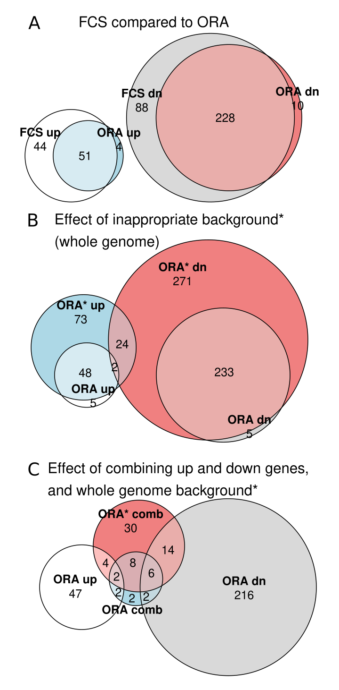
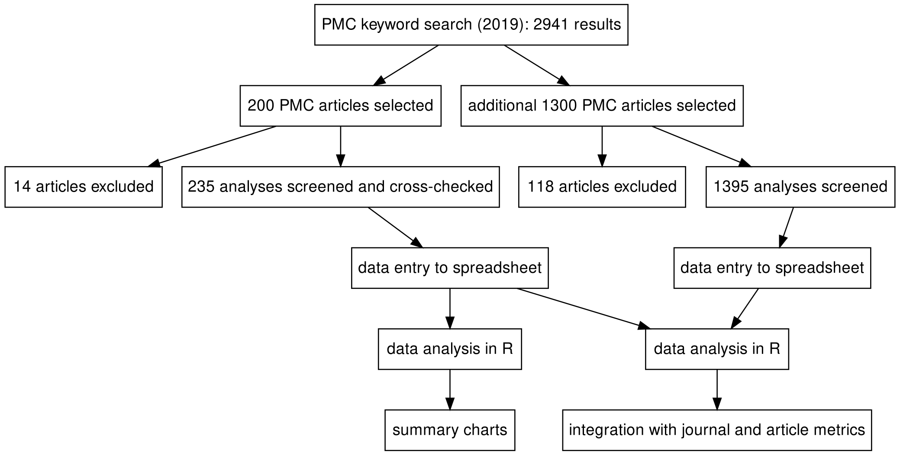

Source: https://github.com/markziemann/SurveyEnrichmentMethods

Target Journal: Briefings in Bioinformatics (JIF=9.0)

Kaumadi Wijesooriya1, Sameer A Jadaan2, Tanuveer Kaur1, Kaushalya L Perera1, Mark Ziemann1

**Affiliations**

1. Deakin University, Geelong, Australia, School of Life and Environmental Sciences.

2. College of Health and Medical Technology, Middle Technical University, Baghdad, Iraq.

## Abstract

Gene set enrichment tests (a.k.a. functional enrichment analysis) are among the most frequently used methods in computational biology.
Despite this popularity, there are concerns that these methods are being applied incorrectly and the results of some peer-reviewed publications are unreliable.
These methodological problems include the use of inappropriate background gene lists, lack of false discovery rate correction and combining up-and down-regulated gene sets before enrichment analysis.
An example analysis of public RNA-seq reveals that these methodological errors alter enrichment results dramatically.
To ascertain the frequency of these errors in the literature, we performed a screen of 186 open access research articles describing functional enrichment results.
We find that 95% of analyses using over-representation tests did not implement an appropriate reference gene list or did not describe this in the methods.
Failure to perform p-value correction for multiple tests was identified in 43% of analyses.
Many studies lacked detail in the methods section about the tools and gene sets used.
Only 15% of studies avoided major flaws, which highlights the poor state of functional enrichment rigour and reporting in the contemporary literature.
We provide a set of minimum standards that should act as a checklist for researchers and peer-reviewers.

## Introduction

Since the turn of the millennium, high throughput "omics" techniques like microarrays and next generation sequencing have brought with them a deluge of data.
These experiments involve the measurement of thousands of genes simultaneously, and can identify hundreds or even thousands of significant associations with developmental stages or diseases.
Interpreting such data is extraordinarily challenging, as the sheer number of associations can be difficult to investigate in a gene-by-gene manner.
Instead, many tools have been developed in an effort to summarise gene profiles into simplified functional categories.
These functional categories typically represent signaling or biochemical pathways, curated from information present in the literature, hence the name functional enrichment.

Widely used functional enrichment tools can be classified into two main categories; (i) over-representation analysis (ORA) and (ii) functional class scoring (FCS), and the most common application is in differential gene expression analysis.
In ORA, differentially expressed genes (DEGs) meeting a significance and/or fold change threshold are queried against curated pathways (gene sets).
A statistical test is performed to ascertain whether the number of DEGs belonging to a particular pathway (gene set) is higher than that expected by random chance.
ORA tools can be stand alone software packages or web services, and they use one or more statistical tests (eg: Fisher’s Exact test, hypergeometric test, binomial test) (Draghici et al, 2003; Hosack et al, 2003).

FCS tools involve giving each detected gene a differential expression score and then evaluating whether the scores are more positive or negative than expected by chance for each set of genes.
The popular Gene Set Enrichment Analysis (GSEA) tool uses permutation approaches to establish whether a gene set is significantly associated with higher or lower scores, either by permuting sample labels or by permuting genes in the differential expression profile (Subramanian et al, 2005).

From a user's perspective, ORA is easier to conduct because it is as simple as pasting a list of gene names into a text box on a website.
FCS tools are more difficult to use, but they are more sensitive at detecting subtle associations (Kaspi and Ziemann 2020; Maleki et al, 2020; Xie et al, 2021).

Although these are powerful tools to summarise complex genomics data, there are concerns that they are not being correctly used.
Tipney and Hunter (2010) warn that inappropriate background set selection heavily influences enrichment results.
Timmons et al (2015) highlight published articles where failure to account for sampling bias invalidated enrichment analysis and conclusions.

The purpose of this work is to survey the frequency of methodological and reporting flaws in the literature, in particular;
(i) lack of a background gene set, 
(ii) lack of p-value adjustment for multiple comparisons and 
(ii) lack of essential methodological details.
We use the results of this survey to inform a set of minimum standards for functional enrichment analysis.

## Methods

### An example gene set analysis

To demonstrate the effect of misusing gene set analysis, a publicly available RNA-seq dataset (accession SRP128998) was downloaded from DEE2 on 13th August 2021 (Ziemann et al, 2019).
This data consists of immortalised human hepatocytes cultured in standard or high glucose, first described by Felisbino et al (2021).
Transcript level counts were aggregated to genes using the getDEE2 R package v1.2.0. 
Next, genes with an average of 10 reads per sample were discarded.
Differential expression statistical analysis was conducted with DESeq2 v1.32.0 (Love et al, 2014) to identify genes altered by high glucose exposure.
For gene set analysis, Reactome gene sets (Jassal et al, 2020) were downloaded (URL: https://reactome.org/download/current/ReactomePathways.gmt.zip , accessed 13th August 2021).
FCS was performed using the mitch R package v1.4.0 with default settings, which uses a rank-ANOVA statistical test (Kaspi and Ziemann 2020).
Genes with FDR<0.05 were used for ORA analysis using the clusterProfiler R package (v4.0.2) enricher function that implements a hypergeometric test (Yu et al, 2012).
No fold-change threshold was used to select genes for ORA.
For ORA, two types of background gene sets were used (i) all detected genes, or (ii) all genes in the annotation set.
For genes and gene sets, a false discovery rate adjusted p-value (FDR) of 0.05 was considered significant.
Analyses were conducted in R version 4.1.0.

### Survey of enrichment analysis 

We collated 2941 articles in PubMed Central published in 2019 that have keywords "enrichment analysis", "pathway analysis" or "ontology analysis".
We sampled 200 of these articles and collected the following information from the article, searching the methods sections and other parts of the article including the supplement.

* Journal name

* Type of omics data

* Gene set library used, and whether a version was reported

* Statistical test used

* Whether p-values were corrected for multiple comparisons

* Software package used, and whether a version was reported

* Whether a background gene set was used

* Code availability

* Whether gene profile was provided in the supplement

* Whether the analysis had any major flaws that might invalidate the results.
This includes:
(i) background gene set not stated or inappropriate background set used,
(ii) lack of FDR correction,
(iii) no enrichment data shown,
(iv) inference without performing any statistical test, and
(v) misinterpreting p-values by stating results were significant when FDR values indicate they aren't.

We excluded articles describing novel enrichment analysis techniques/tools, review articles and conference abstracts.
Some articles presented the results of >1 enrichment analysis, so additional rows were added to accommodate them. 
These data were entered into a Google Spreadsheet by a team of five researchers.
These articles were cross checked by another team member and any discrepancies were resolved.

For analyses using GSEA, we scanned the articles to identify whether key methodological steps were described, including (i) the gene weighting parameter, (ii) test type, ie: permuting sample labels or genes, and (iii) method used for ranking genes.

For ORA of differential gene expression analyses, we inspected the articles to see evidence that researchers were conducting enrichment of up and down regulated genes separately or combined.

Cleaned data were then loaded into R v4.1 for downstream analysis.

For assessment of enrichment analysis quality with journal metrics and citations, we required a larger set of studies so we sampled and analysed a further 1300 articles from PMC.
Results from this sample were not double-checked and so may contain a small number of inaccuracies.
We rated each analysis with a simple approach that deducted points for missing methodological details and awarding points for including extra information (Table 1). 

| 1 point deducted | 1 point awarded |
| --- | --- |
| Gene set library origin not stated | Code made available |
| Gene set library version not stated | Gene lists provided |
| Stat test not stated | |
| No stat test conducted | |
| No FDR correction conducted | |
| App used not stated | |
| App version not stated | |
| Background list not defined | |
| Inappropriate background list used | |

Scimago Journal Rank (SJR) data were downloaded from the Scimago website (https://www.scimagojr.com/journalrank.php) and used to score journals by their citation metrics.
Using NCBI’s Eutils API, we collected the number of citations each article accrued since publication.
We used Pearson correlation tests to assess the association with the analysis scores we generated.
All data analyses were conducted in R v4.1 and the analysis scripts are available at GitHub (https://github.com/markziemann/SurveyEnrichmentMethods).

## Results

### An example of gene set analysis misuse

In order to demonstrate the effect of gene set test misuse, we used an example RNA-seq dataset examining the effect of high glucose exposure on hepatocytes.
Out of 39,297 genes in the annotation set, 15,635 were above the detection threshold (>10 reads per sample on average).
Statistical analysis revealed 3,472 differentially expressed genes with 1,560 up-regulated and 1,912 down-regulated (FDR<0.05) due to glucose exposure.

FCS revealed 95 up and 316 downregulated pathways (FDR<0.05).
ORA with a background gene list consisting of detected genes revealed 55 upregulated and 238 downregulated gene sets (FDR<0.05).
There was a strong overlap between FCS and ORA results with a Jaccard statistic of 0.66 (Figure 1A).

We then performed ORA using the whole genome gene list (indicated as ORA\*), which resulted in 147 up and 530 down regulated gene sets (FDR<0.05),
The overlap of ORA with ORA\* was relatively smaller, with a Jaccard statistic of 0.41 (Figure 1B).
Interestingly, 26 gene sets were simultaneously up and downregulated with this approach.

Then we performed ORA analysis after combining up and downregulated genes as sometimes observed in the literature (indicated as ORA comb) with the standard background and again with a whole genome background (indicated as ORA\* comb).
ORA comb revealed only 22 differentially regulated gene sets with a Jaccard similarity to ORA of only 0.04 (Figure 1C). 
ORA\* comb yielded 64 differentially regulated gene sets with a Jaccard similarity to ORA of only 0.08.
These results demonstrate that commonly observed practices of combining the up and downregulated gene lists and using the whole genome background gene list severely distort ORA results.

### A screen of functional enrichment analyses in open access journals

A search of PubMed Central showed 2941 articles published in 2019 with the keywords "enrichment analysis", "pathway analysis" or "ontology analysis".
From these, 200 articles were screened for methodological errors.
We excluded 14 articles from the screen because they did not present any enrichment analysis. 
Those excluded articles included articles describing novel enrichment analysis techniques or tools, review articles or conference abstracts.
As some articles included more than one enrichment analysis, the dataset included 235 analyses from 186 articles; this data is available in Table S1.
A flow diagram of the survey is provided in Figure 2.

There were articles from 96 journals in the sample, with *PLoS One*, *Scientific Reports*, and *PeerJ* being the biggest contributors (Figure S1A).
There were 18 different omics types, with gene expression array and RNA-seq being the most popular (Figure S1B).
There were 31 different species under study, but human was the most common with 157 analyses (Figure S1C).

We recorded the use of 26 different gene set libraries, with GO and KEGG being the most frequently used (Figure 3A).
There were 14 analyses where the gene set libraries used were not defined in the article.
Only 18 analyses reported the version of the gene set library used (Figure 3B).
There were 12 different statistical tests used, and the most common reported tests were Fisher's Exact, GSEA and hypergeometric tests; but the statistical test used was not reported for the majority of analyses (Figure 3C).
Out of the 225 analyses that performed a statistical test, only 119 (53%) described correction of p-values for multiple testing (Figure 3D).

There were 50 different tools used to perform enrichment analysis, with DAVID and GSEA being the most common; while 15 analyses (6.4%) did not state what tool was used (Figure 3E).
The version of the software used was provided in only 68 of 235 analyses (29%) (Figure 3F).

For analyses using ORA methods, we studied what background gene set was used (Figure 3G). 
This revealed that in most cases, the background list was not stated or it was clear from the article methods section that no background list was used.
In a few cases, background list was mentioned but was inappropriate, for example using a whole genome background for an assay like RNA-seq.
In only 8/197 of cases (4.1%), the appropriate background list was described in the article.

Of the 47 analyses which used a scripted computer language, only 3 provided links to the code used for enrichment analysis (6.4%) (Figure 3H).
For 93 of 235 analyses (40%), the corresponding gene lists/profiles were provided either in the supplement or in the article itself (Figure 3I).

Next, we quantified the frequency of methodological issues and reporting that would undermine the conclusions (Figure 3J).
Lack of appropriate background was the most common issue (179 cases), followed by FDR (94 cases), then lack of data shown (13), inference without test (11 cases), and misinterpreted FDR values (2 cases).
Only 35 analyses (15%) did not exhibit any of these major methodological issues.

During the course of this survey, we also noticed some studies that grouped up- and down-regulated gene lists together prior to ORA, a practice we were not expecting.
To assess this in a systematic way we assessed differential gene expression studies to determine how common it was to combine up- and down-regulated gene lists prior to ORA (Figure 3K).
From 109 analyses, just 28 studies performed separate analysis of up- and down-regulated gene sets.

We also looked at studies performing GSEA, and whether three important analytical choices were described in the methods.
These are (i) the gene weighting parameter, (ii) test type, ie: permuting sample labels or genes, and (iii) method used for ranking genes.
These parameters were not stated in more than half of the analyses (Figure 3L).

Taken together, these data suggest methodological and reporting deficiencies are widespread in published functional enrichment analyses.

![Figure 3. Findings from the survey of published enrichment analyses. (A) Representation of different gene set libraries. (B) Proportion of analyses reporting gene set library version information. (C) Representation of different statistical tests. (D) Proportion of analysis conducting correction of p-values for multiple comparisons. (E) Representation of different software tools for enrichment analysis. (F) Proportion of analyses that reported version information for software used. (G) Background gene set usage and reporting. (H) Proportion of scripted analyses that provided software code. (I) Proportion of analyses that provided gene profiles. (J)  Proportion of analyses with different methodological problems. (K) Whether up- and down-regulated genes were analysed separately or combined. Limited to ORA of differential expression only. (L) Reporting of GSEA parameters.](images/Figure3.png "Figure 3")

### Analysis scores

In order to make an accurate assessment of association between analysis quality and bibliometrics, we required a larger sample of articles.
We therefore analysed a further 1300 articles, bringing the total number of analyses described up to 1630; this dataset is available in Table S2.

We then scored each analysis based on the presence or absence of methodological issues and included details.
The median score was -4, with a mean of -3.5 and standard deviation of 1.4 (Figure 4A).
Next, we assessed whether these analysis scores associate with journal citation metrics (Figure 4B).
There was no statistically significant association of analysis score and SJR (Pearson r=0.03, p=0.23).

Next we wanted to know which journals had the highest and lowest scores.
Only journals with five or more analyses were included.
The best scoring journals were *Transl Psychiatry*, *Metabolites* and *J Exp Clin Cancer Res* (Figure 4C), while the poorest were *RNA Biol*, *Mol Med Rep*, *Cancer Med* and *World J Gastroenterol* (Figure 4D), although we note that there was a wide variation between articles of the same journal.

Then we assessed for an association between mean analysis score and the SJR, for journals with 5 or more analyses (Figure 4E).
Again, there was no association between analysis score and SJR (Pearson r=-0.008, p=0.95).
Next we assessed whether there was any association between analysis scores and the number of citations received by the articles.
After log transforming the citation data, there was no association between citations and analysis scores (Pearson r=0.002, p=0.95) (Figure 4F).
Taken together, these findings suggest that these methodological issues are not limited to lower ranking or poorly cited articles.

## Discussion

While there have been several articles benchmarking the performance of functional enrichment tools, there has been relatively little written on how existing tools are used (or misused).
A recent study looked at the the popularity of frequently used tools and benchmarked their performance (Xie et al, 2021), but this assumes that the tools were properly used and methods sufficiently reported.
In this sample of open access research articles, there appears to be a bias toward tools that are easy to use.
ORA tools that only require pasting lists of gene identifiers into a webpage (ie: DAVID, KOBAS and PANTHER) are collectively more popular than other solutions like GSEA (a standalone graphical user interface software for FCS) or any command line tool.
This is despite the fact that ORA tools perform worse than FCS and new generation pathway topology tools (Kaspi & Ziemann 2020; Maleki et al, 2020; Xie et al, 2021).

Failing to properly describe the background gene list was the most common methodological issue (Figure 3J).
This error can lead to substantially distorted results (Figure 1B).
In the example here, using the inappropriate background resulted in 2.3 fold more differentially regulated gene sets.
Thus if there are few or no significant results using a correct background list, there may be a temptation to use an inappropriate background in order to avoid null results.

The proportion of ORA studies that combined up- and down-regulated gene set was also surprisingly high, at 70% (Figure 3K).
As exemplified in Figure 1C, combining up- and down-regulated genes can severely reduce the number of significant  gene sets (from 293 pathways to just 22 in this example).
This is consistent with a previous report indicating that combining up- and down-regulated gene lists is considered poor practice because it reduces sensitivity (Hong et al, 2014).
These results suggest that a large fraction of published works suffer from a high rate of false negatives, in effect missing a large fraction of truly differentially regulated gene sets.
This is exacerbated by using an inappropriate background gene list, which leads to a high rate of false positives.

Although analyses involving GSEA scored better overall, they were not free of issues.
For example GSEA has different options that impact the results including the ranking metric, gene weighting method and the permutation type (on samples or genes), which were not regularly reported in articles (Figure 3L).

We scored a total of 1630 analyses, revealing only a small fraction of articles obtained a satisfactory score of zero or higher.
The analysis scores we generated did not correlate with journal or article metrics.
This suggests that methodological and reporting problems are not limited to lower ranked journals, but are a more general problem.

Still there are some limitations that need to be recognised.
Many open access articles examined here are from journals not considered to be highly prestigious, and the distribution of analysis scores might be different for closed access articles.
The articles included in this study contained keywords related to functional enrichment in the abstract, and it is plausible that articles in higher ranked journals contain such details in the abstract at lower rates.

Nevertheless, these results are a wake up call for reproducibility and highlight the urgent need for minimum standards for functional enrichment analysis. 
To address this, we provide a set of minimum standards for functional enrichment analysis, as well as additional recommendations to achieve gold standard reliability and reproducibility (Box 1).

### Essential minimum standards for functional enrichment analysis

The following guidelines are selected to avoid the most severe methodological issues while requiring minimal effort to address.

1. Report the origin of the gene sets and the version used or date downloaded.
These databases are regularly upgraded so this is important for reproducibility.

2. Report the tool used and its software version.
As these tools are regularly updated, this will aid reproducibility.

3. If making claims about the regulation of a gene set, then results of a statistical test must be shown (including measures of significance and effect size).
The number of genes belonging to a pathway on its own is insufficient to infer enrichment.
"Data not shown" is not acceptable when it is possible to attach supplementary files.

4. Report which statistical test was used.
This will help long term reproducibility, for example if in future the tool is no longer available.
This is especially relevant for tools that report the results of different statistical tests.

5. Always report FDR or q-values (p-values that have been corrected for multiple tests).
This will reduce the chance of false positives when performing many tests simultaneously (Hung et al, 2012).
Report what method was used for p-value adjustment.
Bonferonni, FDR and FWER are examples.

6. If ORA is used, it is vital to use a background list consisting of all detected genes, and report this in the methods section.
Avoid tools that don't accept a background list.

7. Report selection criteria and parameters.
If performing ORA, then the inclusion thresholds need to be mentioned.
If using GSEA or another FCS tool, parameters around ranking, gene weighting and type of test need to be disclosed (eg: permuting sample labels or gene labels).
Any parameters that are vary from the defaults should be reported.

8. If using ORA for gene expression analysis, be sure to conduct ORA tests separately for up- and down-regulated genes before analysis.
Combining up- and down-regulated genes into a single list will limit sensitivity.

9. Functional enrichment analysis results shouldn't be considered proof of biological plausibility nor validity of omics data analysis (Timmons et al, 2015). 
Such tools are best used to generate new hypotheses; informing subsequent biochemical or signaling experimentation.

### Additional recommendations for enhanced reproducibility 

The following guidelines are directed at going over and above the minimum standards towards a gold standard of reliability and reproducibility.

10. Preference FCS and pathway topology tools over ORA tools.
ORA tools have a lower sensitivity. 
In practice, they are rarely used properly.

11. Include the gene profile data (including any background lists) in the supplementary data in TSV or CSV formats.
Excel spreadsheets are not recommended for genomics work (Ziemann et al, 2016)

12. Scripted analysis workflows are preferred over analysis involving graphical user interfaces because they can attain a higher degree of computational reproducibility, so consider investing in upgrading your analysis.
Similarly, free and open source software tools are preferred over proprietary software.

13. If using a scripted analysis, provide code by depositing it to a repository like GitHub or Zenodo.
Link the data to the code, so anyone can download and reproduce your analysis (Peng 2011).

## Supporting information

[**Table S1**](http://ziemann-lab.net/public/kaumadi/TableS1.tsv "A survey of 186 articles describing functional enrichment results.") A survey of 186 articles describing functional enrichment results.

[**Table S2**](http://ziemann-lab.net/public/kaumadi/TableS2.tsv "A survey of 1365 articles describing functional enrichment results.") A survey of 1365 articles describing functional enrichment results.

## Acknowledgements

We thank XX for comments on the manuscript.
This research was supported by use of the Nectar Research Cloud, a collaborative Australian research platform supported by the NCRIS-funded Australian Research Data Commons (ARDC).

## References

Draghici, S., Khatri, P., Martins, R. P., Ostermeier, G. C., & Krawetz, S. A. (2003). Global functional profiling of gene expression. Genomics, 81(2), 98–104.

Felisbino, M. B., Ziemann, M., Khurana, I., Okabe, J., Al-Hasani, K., Maxwell, S., … El-Osta, A. (2021). Valproic acid influences the expression of genes implicated with hyperglycaemia-induced complement and coagulation pathways. Scientific Reports, 11(1), 2163.

Hong, G., Zhang, W., Li, H., Shen, X., & Guo, Z. (2014). Separate enrichment analysis of pathways for up- and downregulated genes. Journal of the Royal Society, Interface, 11(92), 20130950.

Hosack, D. A., Dennis, G., Jr, Sherman, B. T., Lane, H. C., & Lempicki, R. A. (2003). Identifying biological themes within lists of genes with EASE. Genome Biology, 4(10), R70.

Huang, D. W., Sherman, B. T., & Lempicki, R. A. (2009). Bioinformatics enrichment tools: paths toward the comprehensive functional analysis of large gene lists. Nucleic Acids Research, 37(1), 1–13.

Hung, J.-H., Yang, T.-H., Hu, Z., Weng, Z., & DeLisi, C. (2012). Gene set enrichment analysis: performance evaluation and usage guidelines. Briefings in Bioinformatics, 13(3), 281–291.

Jassal, B., Matthews, L., Viteri, G., Gong, C., Lorente, P., Fabregat, A., … D’Eustachio, P. (2020). The reactome pathway knowledgebase. Nucleic Acids Research, 48(D1), D498–D503.

Kaspi, A., & Ziemann, M. (2020). Mitch: Multi-contrast pathway enrichment for multi-omics and single-cell profiling data. BMC Genomics, 21(1), 447.

Love, M. I., Huber, W., & Anders, S. (2014). Moderated estimation of fold change and dispersion for RNA-seq data with DESeq2. Genome Biology, 15(12), 550.

Maleki, F., Ovens, K., Hogan, D. J., & Kusalik, A. J. (2020). Gene set analysis: Challenges, opportunities, and future research. Frontiers in Genetics, 11, 654.

Peng, R. D. (2011). Reproducible research in computational science. Science (New York, N.Y.), 334(6060), 1226–1227.

Subramanian, A., Tamayo, P., Mootha, V. K., Mukherjee, S., Ebert, B. L., Gillette, M. A., … Mesirov, J. P. (2005). Gene set enrichment analysis: a knowledge-based approach for interpreting genome-wide expression profiles. Proceedings of the National Academy of Sciences of the United States of America, 102(43), 15545–15550.

Timmons, J. A., Szkop, K. J., & Gallagher, I. J. (2015). Multiple sources of bias confound functional enrichment analysis of global -omics data. Genome Biology, 16(1), 186.

Tipney, H., & Hunter, L. (2010). An introduction to effective use of enrichment analysis software. Human Genomics, 4(3), 202–206.

Xie, C., Jauhari, S., & Mora, A. (2021). Popularity and performance of bioinformatics software: the case of gene set analysis. BMC Bioinformatics, 22(1), 191.

Yu, G., Wang, L.-G., Han, Y., & He, Q.-Y. (2012). clusterProfiler: an R package for comparing biological themes among gene clusters. Omics: A Journal of Integrative Biology, 16(5), 284–287.

Ziemann, M., Eren, Y., & El-Osta, A. (2016). Gene name errors are widespread in the scientific literature. Genome Biology, 17(1), 177.

Ziemann, M., Kaspi, A., & El-Osta, A. (2019). Digital expression explorer 2: a repository of uniformly processed RNA sequencing data. GigaScience, 8(4). doi:10.1093/gigascience/giz022